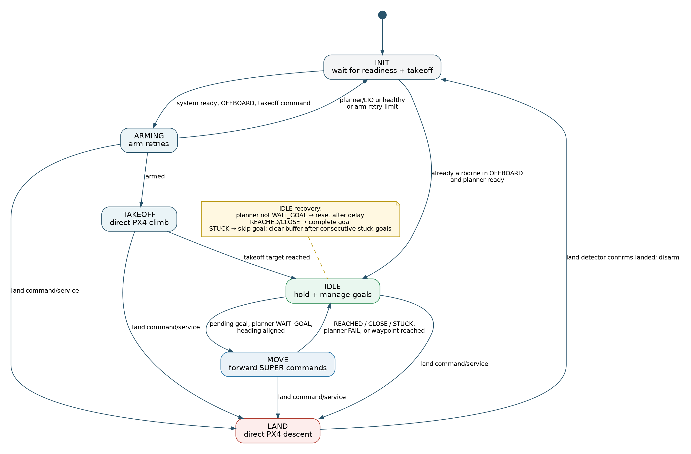
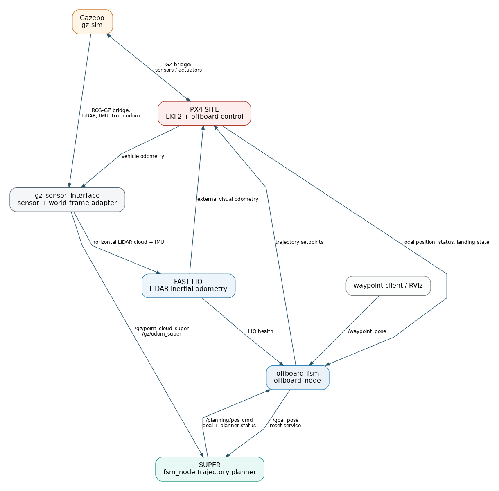

# YunguProject

ROS 2 (Humble) drone autonomy stack for the Yungu flight test: Gazebo + PX4
SITL simulation, the SUPER trajectory planner, optional FAST-LIO localization
(mirrors real hardware) and a PX4 offboard state machine with waypoint
following. Any external search/coverage planner can command the drone by
calling the `/waypoint_buffer` queue service — no launch or code changes. Once the
system is up you take off with a `/takeoff_cmd` message (direct PX4 climb);
navigation between waypoints is planner-driven (SUPER), with automatic
planner-failure recovery and direct PX4 landing.

## Prerequisites

- Ubuntu 22.04 with **ROS 2 Humble** (gz-sim 8 / Harmonic)
- The PX4 fork is a git submodule: clone with `--recursive`
- Before running the Yungu map, put `yungu.glb` under
  `VisionFlow-PX4/Tools/simulation/gz/worlds`

## Setup

```bash
git clone --recursive https://github.com/henryshum0/YunguProject.git
cd YunguProject
./install_deps.sh                  # system + ROS + Python deps (idempotent)
colcon build --symlink-install
source install/setup.bash
```

## Running

The stack runs in two layers (two terminals):

```bash
# Terminal 1 — simulation stack: Gazebo + PX4 SITL + MicroXRCEAgent + gz bridge
./utils/start_sim.sh

# Terminal 2 — simulation-interaction layer (lidar_sensor transforms the
#   left/right/horizontal LiDARs into base_link and publishes four outputs +
#   IMU + truth odom)
ros2 launch gz_sensor_interface sensor_sensors.launch.py

# Terminal 3 — perception + planning + offboard (FAST-LIO is enabled by default;
#   SUPER uses PX4 odometry via super_lidar; offboard_fsm drives the mission)
ros2 launch offboard offboard.launch.py

# Terminal 4 — visualization (TF tree + /gt_path + /fastlio_cloud + RViz windows,
#   all aligned in the drone launch-origin world frame)
ros2 launch visualization visualization.launch.py
```

Stop with `Ctrl+C`; if anything lingers (e.g. `gz-server` detached into its
own session), run `./utils/stop_sim.sh`. Logs go to `/tmp/yungu_sim/`.

### Per-run overrides

Every config value can be overridden without editing the file:

| Variable / arg | Default | Description |
|---|---|---|
| `PX4_MODEL`, `PX4_WORLD` | from `src/navigation/config/simulation.yaml` | Gazebo airframe + world (`PX4_MODEL=gz_<model>_<world>` legacy form also accepted) |
| `XRCE_PORT` | `8888` | uXRCE-DDS port for the MicroXRCEAgent |
| `GZ_VERSION` | `harmonic` | gz-transport version for `ros_gz_bridge` |
| `HEADLESS=1` | *(unset)* | Run Gazebo without its GUI (server only) |
| `rviz:=false`, `rviz_freelook:=false` | `true` | Toggle the two RViz windows in `visualization/visualization.launch.py` |
| `use_fastlio:=false` | `true` | Do not launch `fastlio_mapping` or `fastlio_handler`; PX4 uses its normal estimator inputs instead of FAST-LIO external vision. |

```bash
PX4_MODEL=swan_gamma_v1 PX4_WORLD=indoor_dining ./utils/start_sim.sh
HEADLESS=1 ./utils/start_sim.sh
ros2 launch offboard offboard.launch.py
ros2 launch offboard offboard.launch.py use_fastlio:=false
ros2 launch visualization visualization.launch.py rviz:=false
```

`visualization.launch.py` brings up the birdview overlay + two RViz windows
(top-down birdview planning view, free-rotate 3D debug view), plus the TF tree
(`visual_tf`), `/gt_path` and `/fastlio_cloud`.

## Configuration

Navigation run-time configuration lives in
[`src/navigation/config/`](src/navigation/config/) and is read via
[`src/navigation/config/sim_config.py`](src/navigation/config/sim_config.py) —
edits take effect on the next launch (no rebuild). Coverage planner maps and
missions live separately in [`src/search/config/`](src/search/config/).

| File | Purpose | Key keys |
|---|---|---|
| [`src/navigation/config/simulation.yaml`](src/navigation/config/simulation.yaml) | Sim: model, world, gz version, uXRCE port, GZ→ROS bridge topics | `model`, `world`, `gz_version`, `xrce_port`, `bridge.*` |
| [`src/navigation/config/offboard/topics.yaml`](src/navigation/config/offboard/topics.yaml) | Centralized inter-module communication topics (offboard fsm, SUPER, FAST-LIO, gz_sensor_interface, visualization) | `offboard_fsm.*`, `super.*`, `fastlio.*`, `gz_sensor_interface.*`, `visualization.*` |
| [`src/navigation/config/offboard/offboard_fsm.yaml`](src/navigation/config/offboard/offboard_fsm.yaml) | Offboard state-machine + SUPER integration + FAST-LIO tuning | `use_sim_time`, `update_rate`, `arm_wait`, `arm_retry_*`, `planner_fail_retry_max`, `planner_reset_delay`, `default_height`, `takeoff_vel`, `landing_vel`, `waypoint_*`, `yaw_align_thresh`, `planner_config`, `goal_height`, `planner_cmd_hz`, `cloud_in_topic`, `visualization`, `fastlio_config` |
| [`src/navigation/config/gz_sensor_interface.yaml`](src/navigation/config/gz_sensor_interface.yaml) | Gazebo sensor bridge topics / frames / extrinsics | `lidar_sensor.*`, `imu_bridge.*`, `truth_odom.*`, `super_lidar.*` |
| [`src/navigation/config/visualization.yaml`](src/navigation/config/visualization.yaml) | Visualization TF / topics / birdview | `frames.*`, `visual_tf.*`, `gt_path.*`, `fastlio_visual.*`, `birdview.*`, `rviz.*` |
| [`src/navigation/config/birdview.yaml`](src/navigation/config/birdview.yaml) | Aerial birdview overlay | `extent_*`, `offset_*`, `yaw`, `max_points` |
| [`src/navigation/config/offboard/super_planner/`](src/navigation/config/offboard/super_planner/) | SUPER planner behaviour (A*, traj opt, ROG-Map) | `fsm.click_height`, `super_planner.*`, `traj_opt.*`, `astar.*`, `rog_map.*` |

Set `offboard.visualization: false` for a fully headless run (no RViz, no
birdview overlay, SUPER markers off). `goal_height` is the target altitude that
`goal_marker_node` stamps on RViz "2D Goal Pose" waypoints before forwarding
them to the offboard state machine.

## Flight states & takeoff/landing

The `offboard_node` runs a planner-driven state machine. On start it waits in
`INIT` until odometry, FAST-LIO and the planner are all healthy and the
vehicle is on the ground and disarmed; it then switches PX4 to **OFFBOARD**
mode and waits for a takeoff command.



The image is generated from [`docs/assets/offboard_fsm_state_machine.dot`](docs/assets/offboard_fsm_state_machine.dot).

| State | Behaviour |
|---|---|
| `INIT` | Verifies odometry / FAST-LIO (`fastlio/lio_state.running`) / planner (`fsm/planner_state`) readiness, sets OFFBOARD, then waits for `/takeoff_cmd`. If the FSM restarts while already airborne in OFFBOARD with a ready planner, it resumes in `IDLE`. |
| `ARMING` | Arms, retrying every `arm_retry_delay` (5 s) up to `arm_retry_max` (3) times; on exhaustion returns to `INIT`. |
| `TAKEOFF` | Direct PX4 vertical climb (no planner) to `default_height` at `takeoff_vel`; on reaching altitude → `IDLE`. |
| `IDLE` | Holds position, restarts SUPER when it is not in `WAIT_GOAL`, and manages terminal goal statuses: `REACHED` / `CLOSE` complete the current goal; `STUCK` skips it and clears the buffer after consecutive stuck goals. With a pending goal and aligned heading, it publishes the goal and enters `MOVE`. |
| `MOVE` | Forwards SUPER's `PositionCommand` to PX4. Terminal goal status, planner failure, or local waypoint completion returns it to `IDLE`; absent planner commands hold the current position. |
| `LAND` | Direct PX4 landing (no planner) to `landing_z` at `landing_vel`, then disarms and returns to `INIT`. |

Take off / land at any time:

```bash
# Take off (only accepted once the system is ready in INIT)
ros2 topic pub --once /takeoff_cmd std_msgs/msg/Bool "{data: true}"

# Land (interrupts ARMING, TAKEOFF, IDLE, or MOVE)
ros2 topic pub --once /land_cmd std_msgs/msg/Bool "{data: true}"
```

## Point-to-point navigation (interface for search algorithms)

This is the **only** interface a search/planning algorithm needs. Once the
stack is up, send a `/takeoff_cmd` to take off; the drone climbs directly to
`default_height` and enters `IDLE`. Queue route batches through the waypoint-buffer service.

### Inputs

| Endpoint | Type | Purpose |
|---|---|---|
| `/waypoint_buffer` | `offboard_fsm/srv/QueueWaypoints` | **Batch waypoint input (recommended).** Atomically queues ordered `PoseStamped[]` waypoints. |
| `/waypoint_buffer/clear` | `offboard_fsm/srv/ClearWaypoints` | Aborts the active waypoint, clears queued waypoints, holds position, and resets SUPER. |
| `/waypoint_pose` | `PoseStamped` | RViz/manual single-waypoint input, bridged to the queue service by `goal_marker_node`. |
| `/goal_pose` | `PoseStamped` | **Direct single goal.** Also the internal channel offboard uses to hand the current navigation waypoint to SUPER. |
| `/takeoff_cmd` | `std_msgs/Bool` | **Take off** once the system is ready (`true`). The drone arms and climbs with direct PX4 control to `default_height`. |
| `/land_cmd` | `std_msgs/Bool` | **Land** (`true`). Interrupts `ARMING`, `TAKEOFF`, `IDLE`, or `MOVE` and performs a direct PX4 landing. Ignored in `INIT` and while already landing. |
| `/waypoint_markers` | `MarkerArray` | Feedback: green = queued, yellow = currently pursued, cyan line = route. |

> `/waypoint_pose` remains `best_effort`/`keep_last(1)` for RViz/manual use. Algorithms
> should use `/waypoint_buffer` so a complete route is accepted atomically.

```python
import rclpy
from rclpy.node import Node
from geometry_msgs.msg import PoseStamped

class GoalPublisher(Node):
    def __init__(self):
        super().__init__("goal_publisher")
        self.pub = self.create_publisher(PoseStamped, "/waypoint_pose", 10)
        self.timer = self.create_timer(1.0, self.publish_goal)

    def publish_goal(self):
        msg = PoseStamped()
        msg.header.frame_id = "world"                 # ENU world frame, z up
        msg.pose.position.x, msg.pose.position.y = 10.0, 5.0   # east, north
        msg.pose.position.z = 5.0                     # up [m]
        msg.pose.orientation.w = 1.0                  # yaw follows flight direction
        self.pub.publish(msg)

rclpy.init()
rclpy.spin(GoalPublisher())
```

### Feedback

| Topic | Type | Description |
|---|---|---|
| `/gz/odom_super` | `Odometry` | PX4 EKF local odometry converted from NED to ENU by `super_lidar`; the state feedback consumed by SUPER |
| `/cloud_registered` | `PointCloud2` | World-frame lidar cloud (ROG-Map input) |
| `/planning/pos_cmd` | `PositionCommand` | SUPER's commanded trajectory (pos/vel/acc/yaw/yaw_dot), ~100 Hz |
| `fsm/planner_state` | `super_planner/PlannerState` | High-level planner FSM state (`init` / `wait_goal` / `move` / `fail`) |
| `fastlio/lio_state` | `fast_lio/LioState` | FAST-LIO odometry health (`init` / `running` / `error`) |
| `/fmu/out/vehicle_local_position_v1` | `VehicleLocalPosition` | Raw PX4 local position (NED) |
| `/fmu/out/vehicle_status_v4` | `VehicleStatus` | Arming / nav state |

### Frames & waypoint behaviour

- Waypoints, goals and planner output are **ENU world frame** (`frame_id:
  "world"`, x=east, y=north, z=up); ENU→NED conversion (yaw included) happens
  inside the offboard node.
- A waypoint is reached by **horizontal** distance (`waypoint_reached_dist`),
  then held for `waypoint_hold_time` before the next one is handed to SUPER.
- Waypoint parameters double as launch args, e.g.
  `ros2 launch offboard offboard.launch.py waypoint_reached_dist:=2.0
  waypoint_hold_time:=1.0`.

### Landing

The drone lands with a direct PX4 descent (no planner) at `landing_vel` down
to `landing_z`, then disarms. The `/land_cmd` topic or legacy `~/land` service
works from `ARMING`, `TAKEOFF`, `IDLE`, or `MOVE`:

```bash
ros2 topic pub --once /land_cmd std_msgs/msg/Bool "{data: true}"
ros2 service call /offboard/land std_srvs/srv/Trigger   # legacy, same effect
```

### Recording & evaluation

```bash
# Terminal 3 — recorder + live plot (starts on the first goal)
ros2 launch flight_monitor record.launch.py
# Plot a saved segment afterwards (defaults to the newest CSV in cmd_log/)
ros2 run flight_monitor plot_csv
```

Each goal click writes `cmd_log/goal_<NNN>_<timestamp>.csv` (goal position +
commanded trajectory + real odometry).

## Module dependency graph



The image is generated from [`docs/assets/module_dependency_graph.dot`](docs/assets/module_dependency_graph.dot).

| Package | Role |
|---|---|
| `gz_sensor_interface` | Simulation-interaction: `lidar_sensor`, `imu_bridge`, `truth_odom`, and `super_lidar` (world-frame cloud/odometry for SUPER) |
| `offboard_fsm` | `offboard_node` state machine, `goal_marker_node`, and `fastlio_handler` (FAST-LIO → PX4 external-vision bridge) |
| `SUPER` (`super_planner`, `rog_map`, `mission_planner`) | SUPER planner (`fsm_node`) |
| `FAST_LIO` | LiDAR-inertial odometry (`fastlio_mapping`) |
| `visualization` | Visualization: `visual_tf`, `gt_path`, `fastlio_visual`, `birdview_publisher`, RViz windows |
| `flight_monitor` | `cmd_record` recorder + `plot_csv` |
| `px4_msgs`, `mars_quadrotor_msgs` | ROS 2 message definitions |
| `benchmark` | Random gate/pillar obstacle-map generator for planner benchmarks |

Notes:

- The visualization `world` frame is anchored at the drone launch position
  (same as FAST-LIO `camera_init` and PX4 ENU origin); `/gt_path` is shifted by
  the spawn offset so it lines up with `/fastlio_cloud` and `/gz/point_cloud_super`.
- Ground-truth odometry `/odom` comes from the gz model-instance topic
  `/model/swan_gamma_v2_0/odometry` (see `src/navigation/config/simulation.yaml`); it is used
  by the truth path `/gt_path` and `flight_monitor` comparisons.
- FAST-LIO's `fastlio_handler` feeds PX4 EKF2 external vision
  (`/fmu/in/vehicle_visual_odometry`); the fused
  `/fmu/out/vehicle_odometry` then drives SUPER through `super_lidar`.

## External planner integration

The point-to-point interface above is the execution endpoint for offline
search/coverage planners. A worked example (coverage-search-planner,
`flight_plan.json` → ENU waypoints) is documented in
[`docs/coverage-search-integration.md`](docs/coverage-search-integration.md).
Additional background: [`docs/README_zh.md`](docs/README_zh.md) and
[`docs/utils-fastlio-gz-bridges.md`](docs/utils-fastlio-gz-bridges.md).
