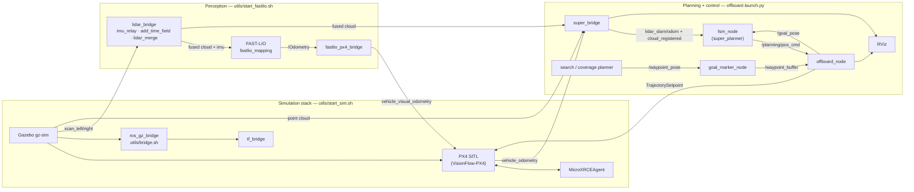

# YunguProject

ROS 2 (Humble) drone autonomy stack for the Yungu flight test: Gazebo + PX4
SITL simulation, the SUPER trajectory planner, optional FAST-LIO localization
(mirrors real hardware) and a PX4 offboard state machine with waypoint
following. Any external search/coverage planner can command the drone by
publishing waypoints on `/waypoint_pose` — no launch or code changes.

## Prerequisites

- Ubuntu 22.04 with **ROS 2 Humble** (gz-sim 8 / Harmonic)
- The PX4 fork is a git submodule: clone with `--recursive`
- Before running the Yungu map, put `yungu.glb` under
  `VisionFlow-PX4/Tools/simulation/gz/worlds`

## Setup

```bash
git clone --recursive https://github.com/henryshum0/YunguProject.git
cd YunguProject
./install_deps.sh                  # system + ROS + Python deps (idempotent)
colcon build --symlink-install
source install/setup.bash
```

## Running

The stack runs in two layers (two terminals):

```bash
# Terminal 1 — simulation stack: Gazebo + PX4 SITL + MicroXRCEAgent + gz bridge
./utils/start_sim.sh

# Terminal 2 — perception + planning + offboard + RViz
#   without FAST-LIO (Gazebo ground truth via super_bridge):
ros2 launch offboard offboard.launch.py
#   with FAST-LIO (LiDAR-inertial odometry fused into PX4 EKF2, real-hw mirror):
./utils/start_fastlio.sh
```

Stop with `Ctrl+C`; if anything lingers (e.g. `gz-server` detached into its
own session), run `./utils/stop_sim.sh`. Logs go to `/tmp/yungu_sim/`.

### Per-run overrides

Every config value can be overridden without editing the file:

| Variable / arg | Default | Description |
|---|---|---|
| `PX4_MODEL`, `PX4_WORLD` | from `config/simulation.yaml` | Gazebo airframe + world (`PX4_MODEL=gz_<model>_<world>` legacy form also accepted) |
| `XRCE_PORT` | `8888` | uXRCE-DDS port for the MicroXRCEAgent |
| `GZ_VERSION` | `harmonic` | gz-transport version for `ros_gz_bridge` |
| `HEADLESS=1` | *(unset)* | Run Gazebo without its GUI (server only) |
| `rviz:=false`, `rviz_freelook:=false` | `true` | Toggle the two RViz windows in `offboard.launch.py` |
| `NO_RVIZ=1` | *(unset)* | Skip RViz in `start_fastlio.sh` |

```bash
PX4_MODEL=swan_gamma_v1 PX4_WORLD=indoor_dining ./utils/start_sim.sh
HEADLESS=1 ./utils/start_sim.sh
ros2 launch offboard offboard.launch.py rviz:=false
```

`offboard.launch.py` also launches the birdview overlay + two RViz windows
(top-down birdview planning view, free-rotate 3D debug view).

## Configuration

All run-time config lives in [`config/`](config/) and is read via
[`config/sim_config.py`](config/sim_config.py) — edits take effect on the next
launch (no rebuild).

| File | Purpose | Key keys |
|---|---|---|
| [`config/simulation.yaml`](config/simulation.yaml) | Sim: model, world, gz version, uXRCE port, GZ→ROS bridge topics | `model`, `world`, `gz_version`, `xrce_port`, `bridge.*` |
| [`config/offboard.yaml`](config/offboard.yaml) | Offboard state machine + planner + waypoint following | `visualization`, `update_rate`, `planner_cmd_hz`, `default_height`, `goal_height`, `planner_config`, `cloud_in_topic`, `waypoint_reached_dist`, `waypoint_hold_time` |
| [`config/super_planner/`](config/super_planner/) | SUPER planner behaviour (A*, traj opt, ROG-Map) | `fsm.click_height`, `super_planner.*`, `traj_opt.*`, `astar.*`, `rog_map.*` |
| [`config/birdview.yaml`](config/birdview.yaml) | Aerial birdview overlay | `extent_*`, `offset_*`, `yaw`, `max_points` |

Set `offboard.visualization: false` for a fully headless run (no RViz, no
birdview overlay, SUPER markers off). `goal_height` overrides SUPER's
`fsm.click_height` for the RViz "2D Goal Pose" tool.

## Point-to-point navigation (interface for search algorithms)

This is the **only** interface a search/planning algorithm needs. Once the
stack is up, the drone auto-takes-off to `default_height` and enters `IDLE`;
command it by publishing a `geometry_msgs/PoseStamped`.

### Inputs

| Topic | Type | Purpose |
|---|---|---|
| `/waypoint_pose` | `PoseStamped` | **Batch waypoint input (recommended).** Queued in the offboard waypoint buffer and flown one at a time. RViz's "2D Goal Pose" tool is re-targeted here. |
| `/goal_pose` | `PoseStamped` | **Direct single goal.** Also the internal channel offboard uses to hand the current waypoint to SUPER. |
| `/waypoint_markers` | `MarkerArray` | Feedback: green = queued, yellow = currently pursued, cyan line = route. |

> QoS caveat: `/waypoint_pose` is `best_effort`/`keep_last(1)` — publish at
> **≥ 0.5 s intervals** and confirm acceptance via the offboard log
> (`Waypoint buffered (#N)`) or `/waypoint_markers`.

```python
import rclpy
from rclpy.node import Node
from geometry_msgs.msg import PoseStamped

class GoalPublisher(Node):
    def __init__(self):
        super().__init__("goal_publisher")
        self.pub = self.create_publisher(PoseStamped, "/waypoint_pose", 10)
        self.timer = self.create_timer(1.0, self.publish_goal)

    def publish_goal(self):
        msg = PoseStamped()
        msg.header.frame_id = "world"                 # ENU world frame, z up
        msg.pose.position.x, msg.pose.position.y = 10.0, 5.0   # east, north
        msg.pose.position.z = 5.0                     # up [m]
        msg.pose.orientation.w = 1.0                  # yaw follows flight direction
        self.pub.publish(msg)

rclpy.init()
rclpy.spin(GoalPublisher())
```

### Feedback

| Topic | Type | Description |
|---|---|---|
| `/lidar_slam/odom` | `Odometry` | Fused world-frame ENU odometry (FAST-LIO → PX4 EKF2, else Gazebo truth) — the state feedback for your algorithm |
| `/cloud_registered` | `PointCloud2` | World-frame lidar cloud (ROG-Map input) |
| `/planning/pos_cmd` | `PositionCommand` | SUPER's commanded trajectory (pos/vel/acc/yaw/yaw_dot), ~100 Hz |
| `/fmu/out/vehicle_local_position_v1` | `VehicleLocalPosition` | Raw PX4 local position (NED) |
| `/fmu/out/vehicle_status_v4` | `VehicleStatus` | Arming / nav state |

### Frames & waypoint behaviour

- Waypoints, goals and planner output are **ENU world frame** (`frame_id:
  "world"`, x=east, y=north, z=up); ENU→NED conversion (yaw included) happens
  inside the offboard node.
- A waypoint is reached by **horizontal** distance (`waypoint_reached_dist`),
  then held for `waypoint_hold_time` before the next one is handed to SUPER.
- Waypoint parameters double as launch args, e.g.
  `ros2 launch offboard offboard.launch.py waypoint_reached_dist:=2.0
  waypoint_hold_time:=1.0`.

### Landing

```bash
ros2 service call /offboard/land std_srvs/srv/Trigger
```

### Recording & evaluation

```bash
# Terminal 3 — recorder + live plot (starts on the first goal)
ros2 launch flight_monitor record.launch.py
# Plot a saved segment afterwards (defaults to the newest CSV in cmd_log/)
ros2 run flight_monitor plot_csv
```

Each goal click writes `cmd_log/goal_<NNN>_<timestamp>.csv` (goal position +
commanded trajectory + real odometry).

## Dependency graph



| Package | Role |
|---|---|
| `offboard` | offboard_node (state machine), super_bridge, goal_marker_node, fastlio_px4_bridge, birdview_publisher |
| `super_planner` (+ `rog_map`, `mission_planner`) | SUPER planner (`fsm_node`) |
| `lidar_bridge` | imu_relay, add_time_field, lidar_merge, tf_bridge |
| `FAST_LIO` | LiDAR-inertial odometry (`fastlio_mapping`) |
| `flight_monitor` | `cmd_record` recorder + `plot_csv` |
| `px4_msgs`, `mars_quadrotor_msgs` | ROS 2 message definitions |
| `benchmark` | Random gate/pillar obstacle-map generator for planner benchmarks |

Notes:

- `tf_bridge` subscribes `/lidar_slam/odom` with `BEST_EFFORT` to match
  super_bridge's publisher — a reliable subscription never receives anything
  and the `world → base_link` TF goes stale.
- Ground-truth odometry `/odom` comes from the gz model-instance topic
  `/model/swan_gamma_v2_0/odometry` (see `config/simulation.yaml`); it is used
  by the truth path `/gt_path` and `flight_monitor` comparisons.
- FAST-LIO's `fastlio_px4_bridge` feeds PX4 EKF2 external vision
  (`/fmu/in/vehicle_visual_odometry`); the fused
  `/fmu/out/vehicle_odometry` then drives SUPER via `super_bridge`.

## External planner integration

The point-to-point interface above is the execution endpoint for offline
search/coverage planners. A worked example (coverage-search-planner,
`flight_plan.json` → ENU waypoints) is documented in
[`docs/coverage-search-integration.md`](docs/coverage-search-integration.md).
Additional background: [`docs/README_zh.md`](docs/README_zh.md) and
[`docs/utils-fastlio-gz-bridges.md`](docs/utils-fastlio-gz-bridges.md).
