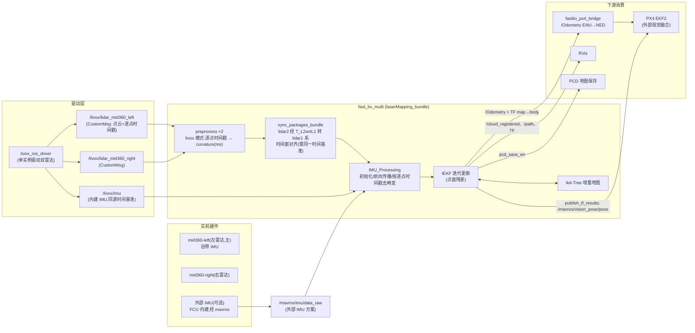
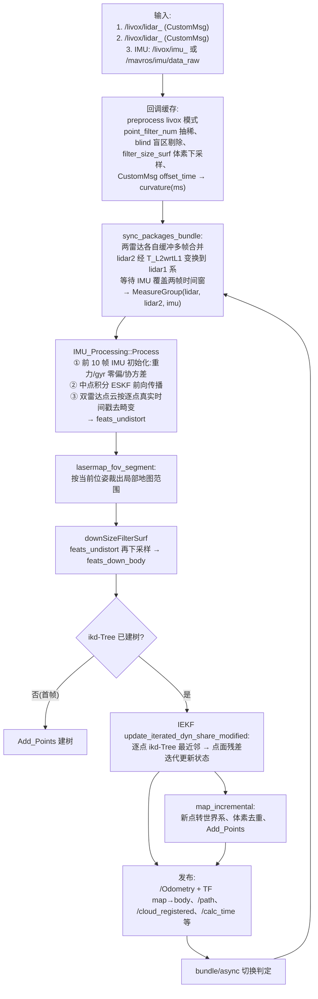

# fast_lio_multi(laserMapping_bundle)实机数据流框图

> 真机场景:2× Livox 激光雷达 + IMU,无仿真胶水层(lidar_transform / lidar_merge / imu_relay 均为仿真专用,实机不需要)。
> 流程图在 VSCode/GitHub 预览中可直接渲染(mermaid)。

## 1. 硬件拓扑与整体数据流

## 2. 节点内部流水线(一帧的处理)

## 3. 实机配置要点(以 `config/multi.yaml` 为基准)

| 项 | 值 | 说明 |
|---|---|---|
| `lid_topic / lid_topic2` | `/livox/lidar_192_168_1_11`、`/livox/lidar_192_168_1_10` | 每台 Livox 一个话题(按 IP);`lidar_type: 1` = Livox CustomMsg,走专用订阅 |
| `imu_topic` | 方案 A:`/livox/imu_192_168_1_11`(主雷达内建 IMU,推荐——与点云同源时间基准) 方案 B:`/mavros/imu/data_raw`(外部 IMU,参考 `sim_midavia.yaml`) | 两方案取其一;内部 IMU 时延最小 |
| `extrinsic_imu_to_lidars` | `true` → 给 `extrinsic_T/R` + `extrinsic_T2/R2`(各自对 IMU 的外参,来自标定) `false` → 给 `extrinsic_T/R` + `extrinsic_{T,R}_L2_wrt_L1`(雷达间相对外参) | **实机外参必须真实标定**(LI-Init 或工厂标定),不能 identity;bundle 模式下融合时 lidar2 实际走 L2→L1 变换 |
| `extrinsic_est_en` | `false` | 多雷达模式不支持在线外参估计 |
| `map_frame` | `map`(上游默认) | 若沿用项目 `fastlio_px4_bridge` 链路(ENU 转换 + 静态 TF 约定),设 `camera_init` + `zero_start_pose: false`,与仿真配置一致 |
| `publish.scan_publish_en` | `true`(实机无 topic 冲突) | 输出 `/cloud_registered` 供 RViz/后续建图 |
| `pcd_save` | `pcd_save_en: true`、`interval: -1` | 实机建图直接落盘 |
| 时间同步 | **关键前提**:两雷达 + IMU 必须在同一时间基准(雷达间 PTP/GPS 同步;用主雷达内建 IMU 则自动同基准) | FAST-LIO 对时间戳回退直接 abort;多传感器各自时钟漂移会直接导致去畸变/对齐错误 |

## 4. 输出话题与消费方

| 输出 | 帧/内容 | 消费方 | 门控 |
|---|---|---|---|
| `/Odometry` | map_frame → body | `fastlio_px4_bridge` → PX4 EKF2;RViz | 常开 |
| TF `map → body` | 动态 TF | RViz、其他感知节点 | 常开 |
| `/cloud_registered` | 注册点云(局部) | RViz、LOAM 类下游 | `publish.scan_publish_en` |
| `/cloud_registered_tf`、`/cloud_registered_body` | 全局/机体系点云 | RViz | `scan_publish_en`(+`dense_publish_en`、`scan_bodyframe_pub_en`) |
| `/path` | 轨迹 | RViz | `publish.path_en` |
| `/Laser_map` | 全图点云 | RViz 建图查看(publisher 存在但主循环未调用,需代码开启) | — |
| `/mavros/vision_pose/pose` | PoseStamped | **实机直连 mavros → PX4 的备选路径**(省掉 fastlio_px4_bridge) | `common.publish_tf_results` |
| `/calc_time`、`/point_number`、`/localizability_*` | 诊断量 | 调试/告警 | 常开 |
| PCD 文件 | 建图结果 | 离线使用 | `pcd_save.pcd_save_en` |

## 5. 实机 vs 仿真数据流差异

| 环节 | 仿真(Gazebo) | 实机 |
|---|---|---|
| 点云来源 | gz gpu_lidar → `lidar_transform` 变换到 base_link | `livox_ros_driver2` 直接发 CustomMsg(自带坐标系 + 逐点时间戳) |
| 点云格式 | PointCloud2、无 time/ring(`lidar_type: 0` default_handler) | CustomMsg(`lidar_type: 1`),逐点 offset_time 驱动去畸变 |
| IMU | gz → `imu_relay` 单调化 | livox 内建 IMU(同基准)或 mavros 外部 IMU |
| 外参 | 全部 identity(云已被搬到 base_link) | 真实标定值(T/R/T2/R2 或 T/R + L2wrtL1) |
| 时间同步 | 单一时钟,无需考虑 | 必须保证(两雷达 PTP 同步 / 用主雷达内建 IMU) |
| 下游 | super_bridge/ROG-Map 等仿真工具 | PX4 外部视觉 / RViz / PCD 保存 |
| 胶水层 | 需要(lidar_transform/lidar_merge/imu_relay) | **全部不需要** |

> 实机最小启动:`ros2 run fast_lio_multi laserMapping_bundle --ros-args --params-file config/multi.yaml`
> (IP 话题名按实际雷达配置改;若只用一台雷达,`multi_lidar: false` 退化为单雷达模式,`lid_topic2` 忽略。)
