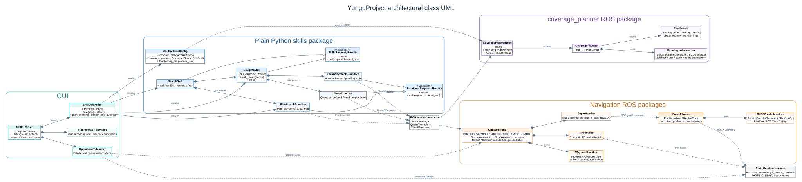
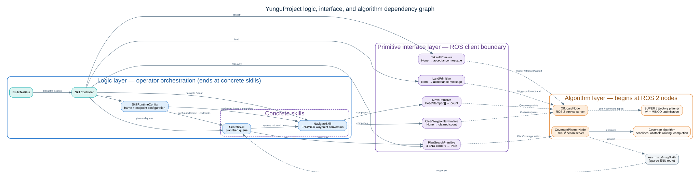

# YunguProject UML and skill graphs

These diagrams document the maintainable command path in YunguProject. They
intentionally omit third-party and generated internals such as ROS 2, PX4,
Gazebo, FAST-LIO, and vendor libraries; those systems are shown as external
ROS boundaries instead of being misrepresented as project-owned classes.

## Architectural class UML



The diagram covers the GUI, skills interfaces, coverage-planning service,
offboard state machine, SUPER, and their main collaborators.

- A hollow arrow denotes inheritance from an abstract contract.
- A diamond denotes composition/ownership.
- A dashed edge denotes an interaction through ROS topics or services rather
  than an in-process object reference.

## Skill and primitive dependency graph



`NavigateSkill` converts coordinate waypoints then composes queue and clear
primitives. `SearchSkill` composes the planning primitive with navigation, so a
successful plan is explicitly queued only by the search skill. The GUI can also
use the plan primitive by itself for a non-publishing preview.

The graph marks three ownership boundaries:

- **Logic layer:** GUI, controller, runtime configuration, and concrete skills.
  This layer ends at `NavigateSkill` and `SearchSkill`.
- **Primitive interface layer:** ROS action/service client adapters. Primitives
  are the boundary between application logic and ROS algorithms.
- **Algorithm layer:** begins at the ROS 2 nodes, then continues into coverage
  planning and SUPER trajectory algorithms.

## Edit and render

The `.dot` files are the sources of truth. Re-render both SVG and PNG after
editing them with Graphviz:

```bash
dot -Tsvg docs/assets/project_class_uml.dot -o docs/assets/project_class_uml.svg
dot -Tpng docs/assets/project_class_uml.dot -o docs/assets/project_class_uml.png
dot -Tsvg docs/assets/skills_dependency_graph.dot -o docs/assets/skills_dependency_graph.svg
dot -Tpng docs/assets/skills_dependency_graph.dot -o docs/assets/skills_dependency_graph.png
```
